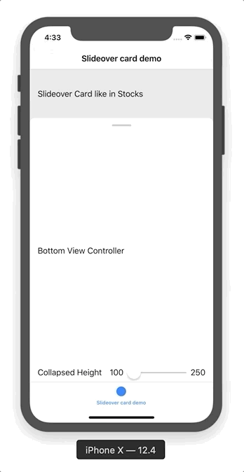

# iOS Slideover Card view controller demo experiment

This is my super-quick experiment to implement slideover card behavior as seen in iOS Stocks or Maps app.

Demo contains:

- injecting top and bottom child view controllers
- dynamic collapsed heights driven by child view view controller itself
- programatic animated transition between modes
- gesture driven transition between modes with natural smooth snapping
- demo of usage compatible with `UITabBarController`, `UINavigationController` and safe areas

_This is demo/research only, not production ready or cleaned up code_ 😉

## Demo

## License

The code in this project is licensed under the MIT License. See [LICENSE](LICENSE) for details.
